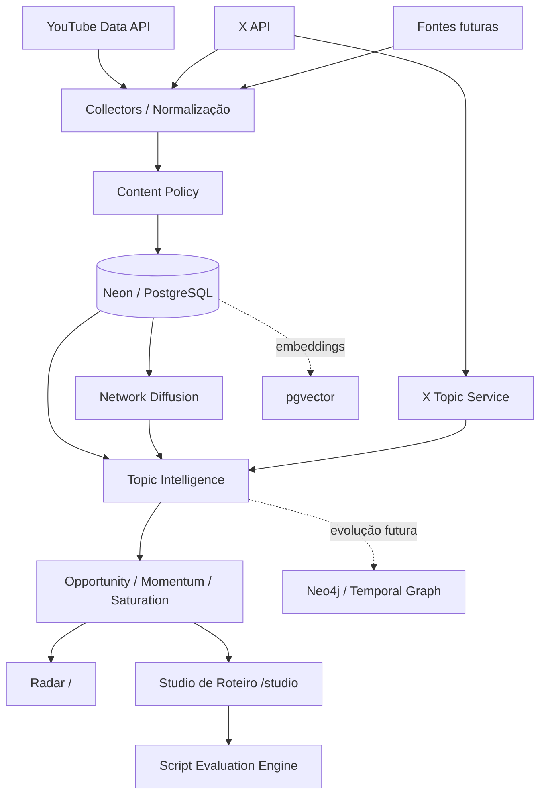

# YouTube Intelligence BR

Sistema de inteligência para criação de vídeos long-form no YouTube brasileiro, desenhado para responder uma pergunta prática:

> **Qual vídeo vale a pena produzir agora, sobre qual tema, com qual estrutura e com quais sinais de que ainda existe espaço para capturar atenção?**

O projeto combina sinais do YouTube, X, histórico próprio, dinâmica de canais, saturação temática e ferramentas de roteiro. A proposta não é ser apenas um dashboard de tendências, mas um **sistema de decisão para creators**, com foco especial em detectar oportunidades antes que um tema fique saturado.

O escopo atual prioriza o mercado brasileiro, vídeos longos (`>= 8 min`) e categorias como notícias/política, ciência/tecnologia, economia/mercados e entretenimento.

---

## Visão do produto

O YouTube Intelligence BR trata atenção como um sistema dinâmico. Um assunto pode estar crescendo no X, começando a aparecer no Google/YouTube, produzindo outliers em canais pequenos e ainda não ter sido ocupado por grandes canais. Esse intervalo é onde pode existir uma oportunidade real de conteúdo.

A arquitetura procura separar cinco perguntas:

1. **O que está recebendo atenção agora?**
2. **Essa atenção está crescendo ou desacelerando?**
3. **Quantos criadores já estão competindo pelo mesmo assunto?**
4. **Existem vídeos performando acima do esperado para o tamanho de seus canais?**
5. **Como transformar o tema em um vídeo com boa embalagem, retenção e comunicação?**

O objetivo de longo prazo é estimar uma forma de **Attention Alpha**: identificar situações em que a atenção esperada é maior que a oferta efetiva de conteúdo no momento em que o vídeo poderá ser publicado.

---

## Estado atual

O projeto já possui duas experiências principais:

### 1. Radar de oportunidades (`/`)

Dashboard principal para observar o mercado e comparar sinais.

Atualmente inclui:

- líderes de vídeos publicados nas últimas 24h;
- quatro grandes categorias do mercado brasileiro;
- ranking Hype persistido;
- ranking semântico de temas;
- saturação temática;
- Momentum e Opportunity Score;
- breakout / Network Escape;
- sinais do X Brasil;
- persistência histórica em Neon/Postgres;
- política central de exclusão de conteúdo.

### 2. Studio de Roteiro (`/studio`)

Ambiente de criação para transformar um tema detectado pelo radar em uma arquitetura de vídeo.

O Studio trabalha em cinco etapas:

1. **Sinal** — escolha do tema a partir do ranking atual;
2. **Núcleo** — tese, promessa, conteúdo essencial, título provisório e duração;
3. **Comunicação** — público, tom e resposta emocional desejada;
4. **Arquitetura narrativa** — blocos reordenáveis com função cognitiva;
5. **Avaliação** — scores objetivos e subjetivos do roteiro.

Os blocos iniciais seguem uma estrutura editável:

```text
Hook
  ↓
Promessa
  ↓
Contexto
  ↓
Evidência
  ↓
Contraponto
  ↓
Virada / surpresa
  ↓
Quebra-gelo / respiro
  ↓
Payoff
  ↓
CTA / continuação
```

Cada bloco possui:

- papel narrativo;
- texto;
- emoção-alvo;
- duração estimada;
- controles para subir, descer, duplicar ou excluir.

Os rascunhos são salvos localmente no navegador.

---

## Funcionalidades

### Líderes de 24 horas

O radar acompanha quatro mercados de conteúdo separadamente:

| Categoria | Estratégia atual |
| --- | --- |
| Notícias e Política | YouTube category 25 + termos complementares |
| Ciência e Tecnologia | YouTube category 28 + termos relacionados |
| Economia / Mercados | termos econômicos + classificação semântica |
| Entretenimento | YouTube category 24 + filtros editoriais |

A coleta utiliza o YouTube Data API com foco no mercado brasileiro:

- `regionCode=BR`;
- `relevanceLanguage=pt`;
- janela recente;
- vídeos long-form;
- hidratação por `videos.list` e `channels.list`;
- aplicação da política editorial antes de persistir/exibir.

**Importante:** `regionCode=BR` significa resultado relevante para o mercado brasileiro; não significa obrigatoriamente que o criador declarou o país do canal como Brasil.

---

### Ranking Hype

O projeto mantém uma camada específica para vídeos Hype.

Há duas fontes possíveis:

1. **snapshot manual do ranking Hype do YouTube Brasil**;
2. **Hype Score interno**, calculado pelo modelo quando há histórico suficiente.

Essas duas coisas são deliberadamente separadas.

O ranking Hype oficial não é inferido a partir de views e não é apresentado como se fosse produzido pela Data API quando não é. Quando um snapshot manual existe, a ordem `HYPE #1 ... #4` fica persistida e não é automaticamente reordenada por mudança de views.

Metadados como views, canal, inscritos, thumbnail e duração podem ser reidratados pela API do YouTube sem alterar a posição do ranking salvo.

---

### Network Escape e breakout

Views absolutas não são suficientes para entender viralização.

Um vídeo com 100 mil views em um canal que normalmente recebe milhões pode estar performando abaixo do esperado; o mesmo número em um canal pequeno pode representar uma propagação excepcional.

O projeto modela esse comportamento em `lib/network-diffusion.ts`.

Conceitualmente:

```text
Network Escape = Views observadas / Reach esperado
```

O reach esperado considera o contexto disponível, incluindo tamanho do canal, idade do vídeo e, quando possível, baseline histórico.

O modelo produz sinais como:

- `expectedReach`;
- `networkEscape`;
- `nodeDifficulty`;
- `breakoutStrength`;
- `viralForce`;
- `hypeScore` interno.

Os tiers de nó são descritivos:

| Tier | Inscritos |
| --- | ---: |
| PERIPHERAL | até 1M |
| MEDIUM | 1M–5M |
| LARGE | 5M–15M |
| HUB | acima de 15M |
| UNKNOWN | indisponível |

O modelo **não dá bônus arbitrário por o canal ser pequeno**. A ideia é medir o quanto um conteúdo escapou do desempenho esperado daquele contexto.

---

### Ranking de temas

Os vídeos são transformados em clusters temáticos próximos de tags semânticas.

Exemplos de um tema podem conter:

```text
Tema: GTA VI
Tags:
- gta vi
- gta 6
- rockstar games
- games
- cultura pop
```

ou:

```text
Tema: Renan Santos / Partido Missão
Tags:
- renan santos
- partido missão
- militância política
- estratégia eleitoral
- eleições 2026
- política brasileira
```

A classificação não depende apenas da categoria ampla do YouTube. O objetivo é representar o **assunto efetivamente disputando atenção**.

O ranking combina, de forma explicável:

- atenção observada;
- momentum;
- breakout;
- saturação;
- diversidade de canais;
- origem das evidências;
- sinais externos do X.

---

### Saturação temática

A saturação não é simplesmente “quantos vídeos têm a mesma tag”.

O sistema considera sobreposição semântica entre assuntos. Dois temas podem ser diferentes e, ainda assim, disputar parte da mesma audiência e espaço editorial.

Exemplo:

```text
STF / Alexandre de Moraes
          ↕ sobreposição parcial
Lula / Jornal Nacional
          ↕ sobreposição parcial
Renan Santos / Partido Missão
```

A implementação atual utiliza uma curva sigmoide para que as primeiras colisões temáticas aumentem a pressão competitiva rapidamente e, depois, apresentem retornos decrescentes.

Isso evita tratar todo o universo de “política” como um único tema, mas também evita assumir que cada personagem vive em uma bolha completamente isolada.

---

### X Brasil

O X funciona como uma segunda camada de detecção de atenção.

A integração usa duas leituras distintas:

#### Trends Brasil

- endpoint de trends por WOEID;
- `WOEID = 23424768` para Brasil;
- até 50 trends por snapshot;
- cache/persistência para evitar consumo desnecessário de créditos.

#### Recent Post Counts

Para cada tema são construídas consultas com aliases e tags semânticas, por exemplo:

```text
(("gta vi" OR "gta 6" OR "rockstar games")) lang:pt
```

A partir dos buckets horários são calculados:

- posts nas últimas 24h;
- posts na última hora completa;
- velocidade;
- aceleração.

A implementação alinha a consulta ao início da hora UTC para não comparar uma hora completa com um bucket parcial.

**Geografia e idioma não são tratados como equivalentes:**

- Trends por WOEID = sinal geográfico Brasil;
- `lang:pt` = sinal linguístico em português, não volume exclusivamente brasileiro.

O enriquecimento está em `lib/x-topic-service.ts`.

TTL atual:

- Trends Brasil: **1 hora**;
- contagens por tema: **3 horas**.

---

## Scores

### Momentum

Representa a dinâmica recente do tema.

Quando o X está disponível, o Momentum do YouTube é preservado como componente separado e combinado com o X Momentum.

Implementação atual:

```text
Momentum combinado
= 72% YouTube Momentum
+ 28% X Momentum
```

### X Momentum

O X Momentum combina os sinais disponíveis de:

```text
posição no Trends Brasil
+
volume relativo de posts
+
velocidade recente
```

Os pesos atuais, quando todos os componentes estão presentes, são:

```text
Trend rank     45%
Volume         30%
Velocidade     25%
```

Quando um componente não existe, os pesos disponíveis são normalizados.

### Opportunity Score

O Opportunity Score busca responder se o tema merece atenção editorial agora.

Quando existe X Momentum:

```text
Opportunity combinado
= 80% Opportunity do YouTube
+ 20% X Momentum
```

Esses pesos são uma versão inicial e devem evoluir com dados reais de performance pós-publicação.

Nenhum score deve ser interpretado como prova causal de que um vídeo irá viralizar.

---

## Arquitetura

### Visão de alto nível



### Grafo conceitual de atenção

A arquitetura de longo prazo modela cinco conjuntos conectados:

```text
Sources ↔ Topics ↔ Platforms ↔ Countries ↔ Content
```

A intenção é representar propagação de informação e atenção entre pessoas, canais, plataformas, países e conteúdos.

Edges futuros podem armazenar:

- `weight`;
- `lag_hours`;
- `confidence`;
- `decay`;
- `historical_reliability`;
- `observed_at`;
- proveniência.

Neo4j está reservado para essa camada, mas o domínio não deve depender diretamente de uma implementação específica de banco de grafos.

---

## Divisão dos módulos

### Interface

```text
app/
├── page.tsx                 # Radar principal
├── studio/
│   └── page.tsx             # Studio de Roteiro
├── components/
│   ├── LeaderRefreshButton  # atualização de líderes
│   └── ScriptStudio         # editor interativo do Studio
└── api/                     # endpoints do produto
```

### Inteligência e domínio

```text
lib/
├── content-policy.ts              # filtros e exclusões editoriais
├── decision-engine.ts             # decisões explicáveis
├── network-diffusion.ts           # Network Escape / breakout
├── topic-diffusion.ts             # propagação por tema
├── topic-intelligence.ts          # inteligência temática
├── topic-ranking.ts               # ranking e saturação
├── script-studio.ts               # modelo e avaliação de roteiros
├── youtube-category-leaders.ts    # coleta de líderes de categoria
├── youtube-category-leader-service.ts
├── youtube-hype-service.ts        # leitura/hidratação do Hype
├── youtube-history-db.ts          # snapshots históricos do YouTube
├── youtube-metric-history.ts      # métricas incrementais
├── x-api.ts                       # cliente X API
├── x-topic-service.ts             # enriquecimento de temas com X
├── x-trends-db.ts                 # snapshots do X
└── providers/                     # adapters de provedores
```

A regra arquitetural é: **provedores coletam e normalizam; serviços de domínio interpretam; a UI apresenta**. Nenhum provedor externo deve escrever diretamente a lógica de decisão.

---

## Data plane

O plano de dados separa descoberta de acompanhamento.

### Descoberta

Descoberta é mais cara porque utiliza busca e precisa encontrar novos candidatos.

```text
YouTube Search
    ↓
IDs candidatos
    ↓
videos.list / channels.list
    ↓
Content Policy
    ↓
Network + Topic scoring
    ↓
Persistência
```

### Tracking incremental

Depois que um vídeo já foi descoberto, não é necessário repetir uma busca cara apenas para saber se ele cresceu.

```text
IDs já conhecidos
    ↓
videos.list
    ↓
novo snapshot
    ↓
Δ views
    ↓
velocity
    ↓
acceleration
```

Essa separação é importante para reduzir consumo de quota e produzir métricas temporais reais.

---

## Persistência

O projeto usa PostgreSQL/Neon como storage operacional e histórico.

Tabelas e famílias de snapshots incluem:

- `youtube_video_snapshots`;
- `youtube_video_metric_snapshots`;
- `youtube_topic_diffusion_snapshots`;
- `youtube_manual_hype_snapshots`;
- snapshots de líderes de categoria;
- snapshots de ranking de canais;
- snapshots do X Trends;
- snapshots de contagem de posts por tema.

Os snapshots temporais usam chaves idempotentes sempre que possível para evitar duplicação em execuções repetidas.

### pgvector

Reservado para memória e recuperação semântica:

- similaridade entre temas;
- histórico de ideias;
- padrões de canal;
- embeddings de títulos/roteiros;
- memória curta, média e longa.

### Neo4j

Reservado para o grafo temporal de propagação quando o volume de relações justificar sua ativação.

---

## Coleta recorrente

A coleta recorrente é separada por custo e finalidade.

### `/api/cron/discover`

Executa descoberta macro:

- busca novos candidatos;
- calcula sinais de rede;
- calcula difusão temática;
- persiste candidatos selecionados.

Essa rota pode consumir quota de YouTube Search.

### `/api/cron/snapshot`

Atualiza apenas vídeos já acompanhados:

- usa IDs conhecidos;
- chama `videos.list`;
- mede deltas reais;
- calcula velocidade/aceleração;
- evita Search Query.

### `/api/cron/sync`

Mantido como rota de compatibilidade/orquestração e para provedores auxiliares.

Todas as rotas de mutação de cron exigem `CRON_SECRET`.

O projeto atualmente respeita as limitações de agendamento do plano configurado na Vercel; jobs de maior frequência não devem ser simulados com configurações inválidas.

---

## API interna

Principais endpoints disponíveis:

| Endpoint | Função |
| --- | --- |
| `GET /api/health` | healthcheck do sistema |
| `GET /api/decisions` | decisão/ranking explicável |
| `GET /api/leaders` | leitura dos líderes atuais |
| `POST /api/leaders` | atualização manual quando permitida |
| `GET /api/hype` | ranking Hype persistido + hidratação |
| `GET /api/topics` | ranking de temas com sinais combinados |
| `GET /api/popularity/current` | leitura de popularidade atual |
| `GET /api/rankings/channels` | snapshots de ranking de canais |
| `/api/cron/discover` | descoberta recorrente protegida |
| `/api/cron/snapshot` | tracking incremental protegido |
| `/api/cron/sync` | orquestração/compatibilidade protegida |

---

## Política editorial de conteúdo

Todos os candidatos passam por `lib/content-policy.ts`.

A política atual pode excluir:

- vídeos abaixo da duração mínima;
- lives/upcoming quando fora do escopo;
- categoria musical;
- videoclipes e marcadores de música;
- canais/conteúdo infantil;
- conteúdo predominantemente pré-adolescente fora do escopo;
- canais religiosos quando não fazem parte do universo editorial pretendido;
- canais explicitamente adicionados à blocklist editorial.

A blocklist é uma decisão de escopo do projeto e não deve ser interpretada automaticamente como uma afirmação factual pública sobre cada canal.

A regra deve ser aplicada tanto na **coleta** quanto na **leitura de snapshots antigos**, evitando que conteúdos bloqueados reapareçam por fallback histórico.

---

## Script Studio e avaliação de comunicação

O motor de avaliação fica em `lib/script-studio.ts`.

O objetivo não é declarar matematicamente se um roteiro “é bom”, mas criar um checklist contínuo e mensurável para revisão.

### Critérios objetivos

Incluem, entre outros:

- presença/posição de hook;
- promessa;
- evidência;
- contraponto;
- virada;
- payoff;
- CTA;
- aderência à duração-alvo;
- blocos excessivamente longos;
- completude dos blocos;
- especificidade da tese e do núcleo.

### Critérios interpretativos

Incluem:

- clareza;
- linguagem efetiva;
- resposta emocional;
- curiosidade;
- engajamento;
- variedade de estímulos;
- divertimento / quebra-gelo;
- ritmo cognitivo.

Esses scores servem como instrumento de revisão e comparação de versões, não como previsão causal de retenção.

---

## AI plane

OpenAI está disponível como provider opcional e deve permanecer atrás de variáveis server-side.

Casos de uso planejados/compatíveis com a arquitetura:

- normalização semântica de temas;
- extração de entidades;
- clustering;
- pesquisa e síntese;
- sugestões de hooks;
- contrapontos;
- reorganização de blocos;
- revisão de linguagem;
- avaliação de afirmações;
- títulos;
- conceitos de thumbnail.

Saídas de IA que entrarem no pipeline persistente devem ser validadas por schema antes de serem gravadas.

O Studio foi deliberadamente construído de forma que a arquitetura de roteiro funcione mesmo sem geração automática por IA.

---

## Runtime e stack

A baseline atual está deliberadamente fixada para compatibilidade:

- **Next.js 16.2.12**
- **React / React DOM 19.2.8**
- **Node.js 24.x**
- **TypeScript 5.9.2**
- **PostgreSQL / Neon**
- **pgvector**
- **Neo4j driver**
- **OpenAI SDK**
- **Google APIs**
- **TanStack Query**
- **Recharts**
- **Vercel**

Veja [`docs/COMPATIBILITY.md`](docs/COMPATIBILITY.md) antes de upgrades estruturais.

---

## Variáveis de ambiente

Copie `.env.example` para `.env.local` e configure apenas os provedores necessários.

Principais variáveis em uso ou previstas:

```bash
# Core
APP_ENV=development
CRON_SECRET=

# YouTube / Google
YOUTUBE_API_KEY=
GOOGLE_CLIENT_ID=
GOOGLE_CLIENT_SECRET=

# X
X_BEARER_TOKEN=

# OpenAI
OPENAI_API_KEY=
OPENAI_MODEL=

# PostgreSQL / Neon
DATABASE_URL=
PGVECTOR_ENABLED=false

# Neo4j
NEO4J_URI=
NEO4J_USERNAME=
NEO4J_PASSWORD=

# Social Blade (opcional e pago)
SOCIALBLADE_ENABLED=false
SOCIALBLADE_CLIENT_ID=
SOCIALBLADE_TOKEN=
```

Nunca exponha tokens no browser ou faça commit de `.env*` com credenciais reais.

---

## Rodando localmente

Use Node.js 24.x.

```bash
npm install
npm run dev
```

Abra:

```text
http://localhost:3000
```

Studio:

```text
http://localhost:3000/studio
```

Validação de tipos:

```bash
npm run typecheck
```

Build de produção:

```bash
npm run build
```

---

## Princípios de engenharia

O projeto segue alguns invariantes:

- não usar scraping proibido do YouTube;
- distinguir dado real, proxy, estimativa e inferência;
- não apresentar um ranking inferido como se fosse um ranking oficial;
- evitar future leakage em modelos pré-publicação;
- manter proveniência e timestamp de dados externos;
- separar coleta cara de atualização incremental barata;
- aplicar política editorial de forma centralizada;
- nunca depender de IA para regras determinísticas simples;
- não publicar conteúdo nem executar ações externas sem autorização explícita;
- preferir métricas explicáveis antes de modelos opacos.

---

## Arquitetura futura

A evolução planejada inclui:

### Benchmark / Outliers Brasil

Uma camada inspirada em ferramentas de outlier discovery, mas especializada no ecossistema brasileiro:

```text
views vs baseline do canal
+
views / inscritos
+
views por hora
+
aceleração
+
Network Escape
+
entrada de grandes canais
+
saturação temática
+
X Momentum
```

Objetivo: detectar vídeos e formatos que estejam performando muito acima do comportamento normal de seus canais.

### Forecasting

- modelos de séries temporais;
- regime switching;
- survival / hazard;
- Hawkes processes para cross-excitation;
- previsão 24h / 7d / 28d;
- intervalos de incerteza;
- previsão no momento esperado de publicação, e não apenas no momento da coleta.

### Grafo temporal

Modelar transporte de informação entre:

```text
pessoas
empresas
criadores
mídia
políticos
livros/autores
podcasts
filmes/séries
comunidades
plataformas
países
tópicos
```

### Pós-publicação

Fechar o loop de aprendizado:

```text
recomendação
  ↓
vídeo produzido
  ↓
performance real
  ↓
retenção / CTR / watch time / views
  ↓
comparação previsão × realizado
  ↓
recalibração dos modelos
```

---

## Estrutura conceitual de decisão

O sistema busca evoluir para algo próximo de:

```text
Expected Future Demand
× Audience Fit
× Differentiation
× Packaging Potential
× Information Advantage
× Longevity
────────────────────────
Expected Future Supply ^ γ

        ↓
Production-Adjusted Opportunity
```

complementado por:

```text
Attention Supply Gap
= Expected Demand / Expected Effective Supply
```

A decisão final deve considerar o **tempo de produção**. Um ótimo tema agora pode ser uma oportunidade ruim se o vídeo levar três dias para ficar pronto e a curva de atenção morrer em 18 horas.

---

## Documentação adicional

- [`docs/ARCHITECTURE.md`](docs/ARCHITECTURE.md) — arquitetura detalhada e fronteiras do domínio;
- [`docs/ROADMAP.md`](docs/ROADMAP.md) — evolução planejada;
- [`docs/COMPATIBILITY.md`](docs/COMPATIBILITY.md) — baseline e política de compatibilidade.

---

## Status

O projeto está em desenvolvimento ativo. A versão atual já opera com dados reais do YouTube, snapshots persistidos, X Brasil, ranking temático, saturação, sinais de breakout e um Studio de Roteiro funcional. As camadas de forecasting, benchmark sistemático de canais, memória vetorial avançada, grafo temporal completo e aprendizado pós-publicação ainda estão em evolução.
